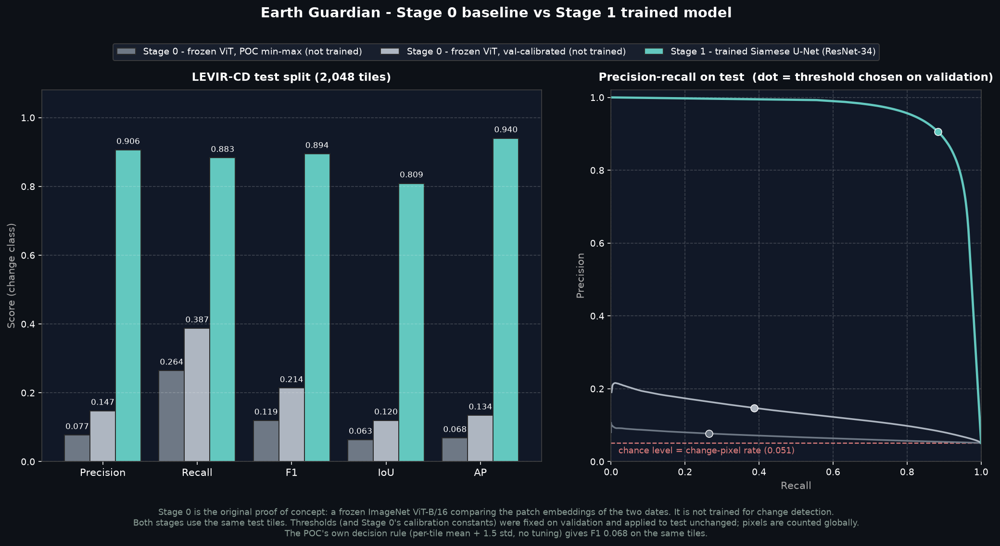

# Earth Guardian

**Understand what changed on Earth.**

Given two satellite images of the same place, taken at different times,
Earth Guardian tells you **what changed, where, and how much** — at the
pixel level, backed by a supervised model trained and evaluated on public
benchmarks, not a heuristic.

> **Scope — read this first.** Earth Guardian has two working monitors today:
> **Construction & Urban Change** (building construction/demolition in optical RGB
> imagery) and **Environment** (forest loss in six-band Sentinel-2 imagery).
> Neither is validated outside the geography and sensor it was trained on;
> neither reports a calibrated probability; there is no real-time or
> global-coverage capability, and no disaster-monitoring domain exists. See
> [Limitations](#limitations).

---

## What Earth Guardian does

```
   BEFORE image  +  AFTER image  (same place, two dates)
                    │
                    ▼
             domain engine (registry-selected)
                    │
                    ▼
        ┌───────────────────────────────┐
        │  What changed?                │   which layer: structural
        │  Where, exactly? (pixel mask) │   change / forest loss
        │  How much? (%, regions)       │
        │  Which direction? (optional,  │   Construction & Urban Change only:
        │   Construction & Urban Change only)     │   Construction / Demolition /
        └───────────────────────────────┘   Uncertain
```

Every domain returns the same structured result — `ChangeResult` — so both the
CLI and the Streamlit product read one contract regardless of which monitor
produced it. See [The structured result](#the-structured-result).

---

## Current capabilities

| | Construction & Urban Change | Environment |
|---|---|---|
| **Detects** | Building construction/demolition | Forest loss |
| **Input** | 2× RGB image, same size | 2× Sentinel-2, **all six bands**: B02 B03 B04 B08 B11 B12 |
| **Model** | Siamese U-Net, shared ResNet-34 encoder | Siamese U-Net, shared ResNet-34 encoder (6-channel stem) |
| **Trained on** | LEVIR-CD (Texas, USA) | JRC Tropical Moist Forest + Sentinel-2, frozen dataset **v24** |
| **Test F1** | **0.8943** | **0.5950** |
| **Extra capability** | Optional direction classifier: Construction / Demolition / Uncertain | — |
| **Ground area (m²)** | Only for georeferenced GeoTIFF input | Only for georeferenced input |
| **Status** | Benchmark-grade | **V1 research model** — see [Environmental monitoring](#environmental-monitoring) |

A third domain, **Disaster** (flood/burn-scar/landslide), is named in the
product as *coming later*. There is no model, no dataset, and no code for it —
it is deliberately absent rather than stubbed.

---

## Where this came from

The original prototype was a frozen, ImageNet-pretrained **ViT-B/16**: before/after
patch embeddings were compared by distance, with no training at all. An audit
found it had **zero task-specific learned parameters** — it had never been
taught what a building looks like. Measured honestly on the same LEVIR-CD test
tiles used today, it scores **F1 0.1192** raw, **F1 0.2135** after
calibration on validation. The frozen POC's own decision rule (per-tile
mean + 1.5·std, no tuning) scores **F1 0.0679**.

The project was then redesigned around a **supervised Siamese U-Net** trained
on real ground truth, which scores **F1 0.8943** on the identical tiles.

**The lesson is not "CNNs beat ViTs."** A ViT could have been trained for this
task too. The lesson is that a frozen, generic feature extractor with zero
supervision cannot compete with a model that was actually taught the task —
supervision is what mattered. The ViT baseline is preserved unchanged in
[`baseline/`](baseline/) and is still scored, on the same protocol, as a
historical control (see [Results](#results) below).

---

## Architecture overview

```
                        INPUT SOURCE   examples/catalogue.json (logical IDs)
                                       or a direct upload
                              │
                              │  applications resolve inputs by domain,
                              │  never by knowing a dataset's layout
                              ▼
                        APPLICATIONS
             predict.py (CLI)        app.py (Streamlit: Home → Analysis → Results)
                              │
                              │  ask the registry for a domain by name
                              ▼
        ┌─────────────────────────────────────────────┐
        │  CORE CONTRACTS                 src/core/    │
        │    registry    name -> engine (lazy)         │
        │    engine      ChangeEngineProtocol           │
        │    types       ChangeResult (schema 1.2)      │
        └─────────────────────────────────────────────┘
                              │
                              ▼
        ┌─────────────────────────────────────────────┐
        │  DOMAIN ENGINES              src/domains/     │
        │    built_environment   RGB, LEVIR-CD           │
        │      + direction/      optional, opt-in        │
        │    environment         6-band Sentinel-2        │
        └─────────────────────────────────────────────┘
                              │
                              ▼
        ┌─────────────────────────────────────────────┐
        │  COMMON                        src/common/    │
        │    pair_input   PreparedPair: model input vs   │
        │                 RGB display preview, separated │
        │    tiling       shared sliding-window inference│
        │    model_loader shared checkpoint loading       │
        │    regions, georef, visualization                │
        └─────────────────────────────────────────────┘
```

**`PreparedPair`** is the mechanism that lets one UI serve two structurally
different sensors: `before`/`after` are whatever the domain's model actually
consumes (3-channel RGB, or 6-band reflectance), while `preview_before`/
`preview_after` are always uint8 RGB, for display only. The UI never reads the
model-input arrays, and a six-band array is never rendered.

The UI itself is **capability-driven**, not domain-name-driven: it asks
`engine.supports_direction`, `provenance.score_calibrated`,
`georef.has_scale`, never `if domain == "built_environment"`. That is what let
the Environment domain — a completely different sensor — be added without
rewriting Home, Analysis or Results.

Full detail: [docs/ARCHITECTURE.md](docs/ARCHITECTURE.md).

---

## Results

<!-- RESULTS:START -->
**LEVIR-CD test split** — 2,048 tiles of 256x256, ground truth
from the official annotations. Threshold **tau = 0.625**,
selected on the validation split and applied to test unchanged.

| Metric (change class) | Test | Validation |
|---|---|---|
| **Precision** | **0.9060** | 0.8945 |
| **Recall**    | **0.8830** | 0.9096 |
| **F1**        | **0.8943** | 0.9020 |
| **IoU**       | **0.8088** | 0.8215 |
| Average precision | 0.9400 | 0.9525 |
| Pixel accuracy | 0.9894 | 0.9917 |

Confusion (test, pixels): TP 6,037,056 · FP 626,723 · FN 800,348 · TN 126,753,601

> **Pixel accuracy is reported only to show that it is uninformative.** About
> 94.9% of test pixels are unchanged, so a model that
> predicts "no change" everywhere scores roughly that accuracy at F1 = 0.
> Precision, Recall, F1 and IoU are computed for the **change class** only.

> **Threshold transfer.** The test-optimal threshold would have been
> 0.590 (F1 0.8944). We do not use it;
> the gap of +0.0001 F1 is the honest cost of selecting the
> threshold on validation, and is reported rather than hidden.

Model `siamese-unet-resnet34` v1.0.0 · encoder `resnet34` ·
best epoch 44 (best) of 50 run · trained on NVIDIA GeForce RTX 5060 Laptop GPU · training time 0:42:01 ·
test inference 17.5s for 2,048 tiles.

### Stage 0 vs Stage 1 — same test tiles, same protocol

| Stage | Method | Trained? | Precision | Recall | F1 | IoU | AP |
|---|---|---|---|---|---|---|---|
| 0 | Frozen ImageNet ViT-B/16 feature distance, per-tile min-max (as in the POC) | No | 0.0770 | 0.2644 | 0.1192 | 0.0634 | 0.0684 |
| 0 | Frozen ImageNet ViT-B/16 feature distance, calibrated on validation | No | 0.1474 | 0.3874 | 0.2135 | 0.1195 | 0.1342 |
| **1** | **Siamese U-Net (ResNet-34), trained on LEVIR-CD** | **Yes** | 0.9060 | 0.8829 | 0.8943 | 0.8088 | 0.9400 |

> **Stage 0 is not a trained change detector.** It is the original proof of
> concept: a frozen ImageNet ViT-B/16 whose patch embeddings are compared
> between the two dates, with the 14x14 distance map upsampled to 256x256.
> It is kept as a control. Every row uses the same 2,048 test tiles.




<!-- RESULTS:END -->

---

## Direction classifier

**Optional, opt-in capability of the Construction & Urban Change monitor.** The primary
detector answers *did this area change*, symmetrically — it cannot say
whether a change was construction or demolition (its training task is
direction-blind by design; see [Method](#method)). A **separate, frozen
ResNet-18** answers that second question for regions the detector has already
found.

| | |
|---|---|
| Input | 6-channel: Before RGB + After RGB, 128×128 region crop, 25% context |
| Trained on | S2Looking (official split), region-level construction/demolition targets derived by this project's own pipeline |
| Classes | Construction, Demolition, **Uncertain** (abstention, not a trained class) |

| Metric (test) | Value |
|---|---|
| Macro-F1 (headline) | **0.9608** |
| Balanced accuracy | 0.9601 |
| Accuracy | 0.9631 |
| ECE (calibration error) | 0.0172 |
| Abstention threshold | 0.960 |
| Test coverage (not abstained) | 0.8948 |
| Retained accuracy | 0.9868 |
| Retained macro-F1 | 0.9858 |

**Read this metric correctly.** It is measured on **S2Looking's own
ground-truth regions**, not on regions produced by the LEVIR-CD detector —
deliberately, because an end-to-end number would confound detector domain
shift with classifier quality and is not what this metric claims to measure.
There is no published end-to-end (detector + direction, one pipeline, one
benchmark) evaluation number.

**"Uncertain" is the model declining to answer**, not a ground-truth class —
when its confidence doesn't clear the abstention threshold, it says so instead
of guessing. **`direction_score` is not a calibrated probability**; the
classifier is measurably over-confident (ECE 0.0172).

One more honesty note: which S2Looking image is *earlier* is not documented by
the dataset's authors. The mapping used here (`BEFORE = Image2, AFTER =
Image1`) is a **ratified project decision**, carried as
`documented_by_authors: false` in every training artifact. If that assumption
is ever overturned, every construction/demolition label in this classifier
inverts. Full detail: [docs/DIRECTION_CLASSIFIER_MODEL_CARD.md](docs/DIRECTION_CLASSIFIER_MODEL_CARD.md).

---

## Environmental monitoring

Six-band Sentinel-2 L2A surface reflectance — **B02, B03, B04, B08, B11,
B12** — for forest-loss detection against JRC Tropical Moist Forest (TMF)
labels. **The RGB preview shown in the UI is for human display only; the
model always receives all six bands**, and an RGB-only upload is refused
rather than padded or substituted.

**Frozen dataset v24**: 295 samples (140 positive / 155 negative), split
207 train / 44 validation / 44 test, geographically disjoint by MGRS tile with
a measured minimum separation of **100.58 km** between splits. 249 samples
from the Amazon, 46 from Southeast Asia.

| Metric (test, pixel-level) | Value |
|---|---|
| Precision | 0.5505 |
| Recall | 0.6472 |
| **F1** | **0.5950** |
| IoU | 0.4235 |
| AP | 0.5670 |

Threshold **0.91**, selected on validation only, applied to test unchanged.

**This is meaningfully lower than Construction & Urban Change, on purpose reported
honestly, not hidden:**

- **Region-level agreement is poor** (region F1 0.1136) even though pixel
  agreement is moderate — the model recovers roughly the right total extent
  but disagrees about how it's divided into distinct clearings. A detected
  region should not be read as one reliably identified clearing.
- **Output is a 10 m grid; the reference labels are 30 m-quantized** — TMF
  labels are resampled from 30 m to the 10 m grid the model operates on, so
  boundaries are accurate to about one TMF pixel, not to 10 m.
- **Scores are not calibrated probabilities.** No calibration has been fitted
  or measured for this model.
- **Geography is limited to the Amazon and Southeast Asia.** Africa is absent
  from the training data entirely (the JRC data endpoint fails for every Congo
  Basin longitude tried) — this says nothing about African forest loss.
- This is a **V1 research model**: one training run, one dataset version, no
  hyperparameter search, less mature than the Construction & Urban Change benchmark.

Three curated examples from the frozen v24 **test** split ship with the
product (never chosen by how well the model scores on them — see
[`examples/catalogue.json`](examples/catalogue.json)).

Full detail: [docs/ENVIRONMENT_BASELINE_MODEL_CARD.md](docs/ENVIRONMENT_BASELINE_MODEL_CARD.md).

### Spectral ablation

The six-band requirement is evidenced, not assumed. Same protocol, same test
samples, only the input bands differ:

| Input | Test F1 |
|---|---|
| RGB only | 0.4164 |
| RGB + NIR (B08) | 0.4302 |
| **All six bands (+ SWIR B11/B12)** | **0.5950** |

The two SWIR bands alone are worth roughly **+0.18 F1** — the evidence behind
the product refusing plain RGB uploads for this domain.

A further experiment (**E3**) tested whether supervising the loss at TMF's
native ~30 m spatial support, instead of the model's native 10 m grid, would
close the region-level gap above. It did not: E3@10 F1 0.5324, E3@30 F1
0.5375, against the frozen model's own E2@30 F1 0.5981 — the hypothesis was
refuted, so label granularity alone does not explain the region-level
disagreement.

---

## Demo / running the application

### 1. Environment

RTX 50-series (Blackwell) requires a CUDA 12.8+ build of PyTorch:

```bash
python -m venv .venv312                       # Python 3.12 recommended
.venv312\Scripts\activate                     # Windows
pip install torch torchvision --index-url https://download.pytorch.org/whl/cu128
pip install -r requirements.txt
```

### 2. Data and checkpoints

**Neither the datasets nor the trained checkpoints are in this repository** —
see [Reproducibility](#reproducibility-and-large-local-assets). To run the
Construction & Urban Change monitor from scratch:

```bash
python scripts/download_levir.py            # ~2.5 GB, resumable, official split
python scripts/prepare_tiles.py             # 1024^2 scenes -> 256^2 tiles
python scripts/build_example_catalogue.py   # bundled demo examples
python -m src.train.train --epochs 50 --batch-size 32
```

The Environment monitor's demo examples are already bundled under
`examples/environment/` (tracked, 9.3 MB); running it on new data needs the
frozen v24 archive and `outputs/environment_baseline/environment_sixband_best.pt`
(see below).

### 3. Run the product

```bash
streamlit run app.py
```

Three screens: **Home** (choose a monitor), **Analysis** (pick a bundled
example or upload your own pair — each monitor states exactly what it needs
before you choose), **Results** (verdict, visualization, metrics, regions,
and direction when applicable). Inference runs once, when **Analyze change**
is pressed; every other interaction reads the stored `ChangeResult`.

### 4. CLI inference

```bash
python predict.py --before images/before1.png --after images/after1.png
```

Writes a mask, probability map, overlay and a structured `result.json`.

---

## The structured result

The JSON is the product's actual interface; every visual is a renderer over it.

`ChangeResult`, schema v1.2:

```json
{
  "schema_version": "1.2",
  "layers":   [{"name": "structural_change", "threshold": 0.625,
                "changed_pixels": 0, "mean_confidence": 0.0,
                "has_score_map": true, "description": "..."}],
  "regions":  [{"id": 1, "area_px": 0, "bbox_xywh": [0,0,0,0],
                "centroid_xy": [0,0], "layer": "structural_change",
                "direction": null, "direction_score": null}],
  "quantities": {"changed_pixels": 0, "total_pixels": 1048576,
                 "changed_percentage": 0.0, "area_m2": null},
  "provenance": {"model": "siamese-unet-resnet34", "version": "1.0.0",
                 "task": "Binary structural change detection",
                 "dataset": "LEVIR-CD", "threshold": 0.625,
                 "weights_hash": "...", "evaluation_protocol": "...",
                 "operating_envelope": {"gsd_m_range": [0.3, 1.0], "...": "..."},
                 "dataset_version": null, "score_calibrated": null},
  "input":  {"height": 1024, "width": 1024},
  "georef": null,
  "params": {"threshold": 0.625, "min_area_px": 32, "tile": 256, "overlap": 64},
  "runtime_seconds": 0.0,
  "warnings": []
}
```

`layers` is a list so a multi-class engine fits without a schema break; each
current engine emits exactly one. `regions[].direction` /
`direction_score` (schema 1.2) are populated only when direction
classification was explicitly requested — they belong to the direction
classifier, a different model from the detector, and stay `null` otherwise.
`provenance.dataset_version` / `score_calibrated` (also 1.2, both additive and
optional — schema was **not** bumped to introduce them, since they change no
existing engine's output) let a consumer tell which dataset snapshot produced
a result and whether its scores may be read as probabilities — for the
Environment engine, `score_calibrated` is explicitly `false`.

`area_m2` is `null` unless a real ground sample distance is supplied through a
valid `GeoRef` — never fabricated from an assumption about resolution.

---

## Method

**Model.** Siamese U-Net. One ImageNet-pretrained ResNet-34 encoder processes
both dates with **shared weights**. At each of five scales the two feature maps
are fused as `conv1x1(concat[|f_a − f_b|, f_a + f_b])` — the difference carries
the change signal, the sum carries scene context. A U-Net decoder returns one
logit per pixel at full input resolution. 25.1 M parameters (Built
Environment, 3-channel; the Environment engine uses the same design with a
6-channel input stem, 25.15 M parameters).

**Loss.** `0.5 · BCE(pos_weight) + 0.5 · (1 − Dice)`. Both domains are heavily
class-imbalanced (LEVIR-CD ~95% unchanged pixels; the environment training set
uses `pos_weight` 13.364); plain BCE alone collapses to predicting "no change".

**Task symmetry (Construction & Urban Change).** The label marks that pixels differ, not
in which direction, so the task is symmetric under swapping the two dates —
which is why date-swap is a valid training augmentation, and why the primary
detector genuinely cannot distinguish construction from demolition on its own.
The direction classifier is a separate model for exactly that reason.

**Inference.** Images larger than the model's training tile are processed
with overlapping 256×256 tiles blended by a 2-D Hann window (shared by both
domains via `src/common/tiling.py`), so full scenes come back without tile
seams.

**Evaluation.** TP/FP/FN/TN are accumulated **globally** over a split, not
averaged per image — the LEVIR-CD convention, applied consistently to the
Environment domain too. Per-image averaging inflates scores because empty
tiles produce degenerate per-image F1.

Full rationale: [docs/ARCHITECTURE.md](docs/ARCHITECTURE.md).

---

## Repository structure

```
src/config.py                       all project paths in one place
src/core/                           domain-independent contracts
    types.py                          ChangeResult, Layer, Region, Quantities,
                                      Provenance, GeoRef, InputSpec (schema 1.2)
    engine.py                         ChangeEngineProtocol, EngineMetadata
    registry.py                       engine name -> implementation (lazy)
src/common/                         shared services, no domain knowledge
    pair_input.py                     domain-aware input dispatch, PreparedPair
    tiling.py                         shared sliding-window inference
    preprocessing.py                  normalisation contract
    model_loader.py                   checkpoint -> model
    examples.py                       example catalogue loader (input source)
    regions.py, georef.py, visualization.py
examples/catalogue.json             bundled examples: logical ID -> file paths
examples/environment/               curated six-band demo examples (tracked)
src/domains/
    built_environment/               RGB structural change (LEVIR-CD)
        data/levir.py                  dataset + augmentation
        data/s2looking.py              region-target derivation (research only)
        direction/                     optional direction classifier (ResNet-18)
        engine.py, model_card.py
    environment/                     six-band forest-loss (JRC TMF + Sentinel-2)
        data/                           Sentinel-2, TMF, STAC acquisition
        engine.py, model_card.py, inputs.py, normalization.py, region_metrics.py
    (disaster)                       NOT IMPLEMENTED — no model, no code
src/models/siamese_unet.py          architecture (shared across domains)
src/train/, src/eval/, src/viz/     training loop, metrics, figures
baseline/                           Stage 0 POC (frozen ViT) — preserved
ui/                                 Streamlit product: Home / Analysis / Results
    domains.py                        per-domain presentation copy (no model logic)
    panels/direction.py               all direction-specific UI, one place
scripts/                            dataset builders, trainers, evaluators, figures
                                    (28 scripts — see docs/ for what each backs)
predict.py                          CLI
app.py                              Streamlit entry point (router only)
docs/                               architecture, dataset, and model-card documentation
tests/                              504 tests across ML pipeline and UI architecture
```

Applications ask the registry for a domain rather than importing a model:

```python
from src.core import registry
engine = registry.get("built_environment")   # or "environment"
```

See [docs/ARCHITECTURE.md](docs/ARCHITECTURE.md) for the full layering and the
result contract.

---

## Training / evaluation overview

| Domain | Train | Evaluate |
|---|---|---|
| Construction & Urban Change | `python -m src.train.train --epochs 50 --batch-size 32` | `python -m src.eval.evaluate` |
| Direction classifier | `python scripts/train_direction_classifier.py` | `python scripts/evaluate_direction_classifier.py` |
| Environment (E2, production) | `python scripts/train_environment_baseline.py` | `python scripts/evaluate_environment_baseline.py` |
| Stage 0 control | — (frozen, untrained) | `python -m src.eval.evaluate_baseline` |

Figures: `python -m src.viz.figures` (Construction & Urban Change) and
`python -m src.viz.compare_figures` (Stage 0 vs Stage 1) write to
`outputs/figures/`. Environment-specific figures/reports:
`scripts/environment_baseline_model_card.py`,
`scripts/compare_environment_ablation.py`,
`scripts/analyze_environment_failures.py`.

Each training script selects its checkpoint and threshold **on validation
only**, then scores **test exactly once**, unchanged — the discipline
documented per-model in `docs/*_MODEL_CARD.md`.

---

## Reproducibility and large local assets

**This repository does not contain the datasets or the trained model
weights.** Both are large, both are reproducible from the scripts above, and
neither is committed:

| Asset | Size | Location (local, gitignored) | Reproduce with |
|---|---|---|---|
| LEVIR-CD + tiles | ~2.5 GB+ | `data/levir_cd/`, `data/levir_cd_tiles/` | `scripts/download_levir.py`, `scripts/prepare_tiles.py` |
| S2Looking | large | `data/s2looking/` | `scripts/download_s2looking.py` |
| Environment dataset v24 | ~503 MB | `data/environment/dataset_v24/` | `scripts/build_environment_dataset_v24.py` (built on the v2.1–v2.3 lineage — see [docs/DATASET.md](docs/DATASET.md)) |
| Construction & Urban Change checkpoint | ~97 MB | `checkpoints/siamese_unet_r34_best.pt` | `python -m src.train.train` |
| Direction classifier checkpoint | ~43 MB | `checkpoints/direction_resnet18_both_best.pt` | `scripts/train_direction_classifier.py` |
| **Environment production checkpoint** | **~97 MB** | `outputs/environment_baseline/environment_sixband_best.pt` | `scripts/train_environment_baseline.py` |

The environment checkpoint lives under `outputs/` rather than `checkpoints/`
deliberately: the experiment manifest, training history and evaluation JSON
sitting beside it are what make the weights interpretable, and moving it would
break that link (see `src/config.py`). It is gitignored specifically (not the
whole directory) so the small JSON/CSV/PNG artifacts around it stay tracked.

**A fresh clone of this repository cannot run inference until the relevant
checkpoint is either reproduced by training or obtained separately.** The
bundled demo examples (`examples/`) are the exception — they are small,
tracked, and work without the 34 GB `data/` directory.

---

## Limitations

**Construction & Urban Change**
- Buildings only. Trained on LEVIR-CD; vegetation, water, fire and snow change
  are not represented in the labels and are not detected.
- One geography — all training data is from 20 regions in Texas, USA.
  Generalization elsewhere is untested.
- Co-registration is assumed; there is no registration step, so misaligned
  inputs produce false positives.
- No georeferencing unless a valid GeoTIFF with a projected metric CRS is
  supplied — otherwise there is no ground area, only pixels and percentage.
- Single architecture, single seed — no comparison study has been run.
- The primary detector cannot distinguish construction from demolition by
  itself (task is symmetric by design); only the separate, optional direction
  classifier can, and only per already-detected region.

**Direction classifier**
- The temporal ordering it relies on (`BEFORE = Image2, AFTER = Image1`) is a
  **ratified project assumption**, not an S2Looking-author-documented fact. If
  overturned, every construction/demolition label inverts.
- Its headline metric is measured on S2Looking's own ground-truth regions, not
  end-to-end through the LEVIR-CD detector's own region proposals — there is
  no published end-to-end number.
- Scores are not calibrated probabilities (ECE 0.0172); "Uncertain" is
  abstention, not a trained class.

**Environment**
- Requires all six declared Sentinel-2 bands; RGB-only input is refused, not
  substituted.
- Validated only on the Amazon and Southeast Asia; Africa is entirely absent
  from training data.
- Scores are not calibrated probabilities.
- Output is a 10 m grid; reference labels are 30 m-quantized, so boundary
  precision is limited to about one TMF pixel.
- Region-level agreement is poor (region F1 0.1136) even where pixel-level
  agreement is moderate — a detected region is not a reliably identified
  individual clearing.
- One dataset version, one training run, no hyperparameter search — a V1
  research model, not a validated detector.

**Both domains / the product overall**
- No real-time monitoring — this is paired-image, on-demand analysis.
- No global operational coverage — both models are geography-specific.
- No disaster-monitoring capability exists; it is named as planned with no
  model behind it.
- Ground area in m² is available only when the input actually carries a valid
  projected metric georeference and scale — most bundled examples do not, and
  none of it is invented.

---

## Future work

- Cross-dataset generalization testing for Construction & Urban Change (e.g. WHU-CD) and
  broader regional validation for Environment.
- An imagery provider (location + date search) to replace manual upload —
  not implemented; the current input source is the bundled example catalogue
  or direct upload only.
- Georeferenced imagery ingestion so ground-area reporting works for more than
  GeoTIFF uploads.
- Calibrating the Environment engine's score so it can honestly be reported as
  a probability.
- Extending region direction classification to the Environment domain.
- A validated Disaster-monitoring domain — currently not started.

---

## Authors

Aryan Goyal (2427030332) and Aryan Tyagi (2427030344)
B.Tech CSE, Manipal University Jaipur — supervised by Dr. Ajay Kumar
