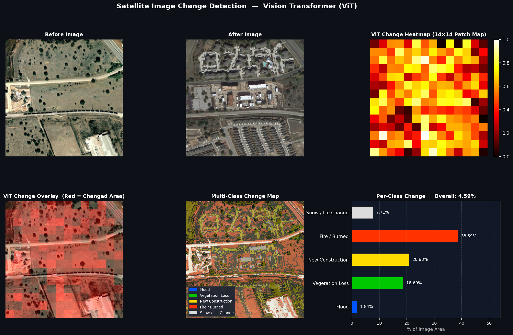
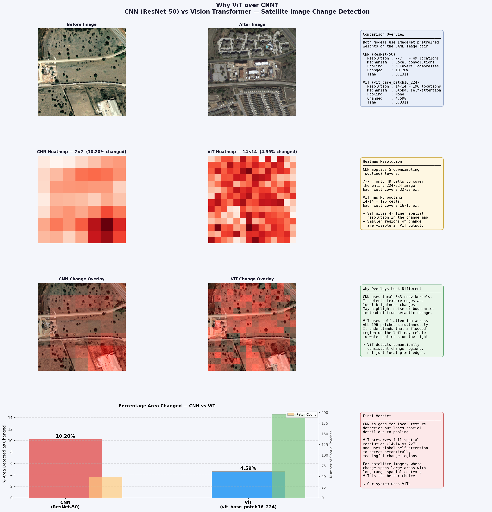

# Satellite Image Change Detection using Vision Transformer (ViT)

A deep learning–based framework for detecting and quantifying spatial changes between multi-temporal satellite images using a pretrained Vision Transformer (ViT), with a side-by-side CNN vs ViT comparison to justify model selection.

---

## Sample Outputs

### Main Result — ViT Change Detection


### Model Comparison — CNN vs ViT


---

## Overview

This project implements a transformer-based approach for satellite image change detection. By extracting patch-level embeddings from temporal image pairs and computing feature differences, the system identifies and visualizes environmental and structural changes.

A separate comparison script (`cnn_compare.py`) runs both ResNet-50 (CNN) and ViT on the same image pair to empirically demonstrate why ViT is the better choice for this task.

---

## Key Features

- Patch-level feature extraction using pretrained Vision Transformer (`vit_base_patch16_224`)
- 14×14 change heatmap with `hot` colormap and colorbar
- Visual red overlay highlighting detected changed regions
- Rule-based multi-class environmental categorization:
  - 🔵 Flood
  - 🟢 Vegetation Loss
  - 🟡 New Construction
  - 🔴 Fire / Burned Area
  - ⚪ Snow / Ice Change
- Per-class percentage bar chart for each change category
- Adaptive thresholding for honest, conservative percentage estimation
- CNN (ResNet-50) vs ViT comparison script with 4-row visual report

---

## Why ViT over CNN?

| Metric | CNN (ResNet-50) | ViT |
|---|---|---|
| Spatial Map Resolution | 7×7 (49 patches) | 14×14 (196 patches) |
| Spatial Detail | Low | 4× Higher |
| Context Mechanism | Local convolutions | Global self-attention |
| Pooling Layers | 5 (compresses detail) | None |

CNN applies 5 pooling layers, compressing the spatial map to just 49 locations. ViT preserves all 196 patch tokens with no pooling, giving 4× finer spatial resolution and global context — making it better suited for satellite imagery where changes span large areas.

---

## Technology Stack

- Python
- PyTorch
- timm (Vision Transformer models)
- torchvision (ResNet-50 for comparison)
- NumPy
- Matplotlib
- Pillow (PIL)

---

## Project Structure

```
Satellite-Image-Change-Detection-ViT/
│
├── images/
│   ├── before.png          ← your input before image
│   └── after.png           ← your input after image
│
├── outputs/
│   ├── output_vit_result.png
│   └── output_cnn_vs_vit.png
│
├── main.py                 ← main ViT change detection system
├── cnn_compare.py          ← CNN vs ViT comparison (justification)
├── requirements.txt
└── README.md
```

---

## Installation & Usage

### 1. Clone the Repository

```bash
git clone https://github.com/Aryan-Goyal30/Satellite-Image-Change-Detection-ViT.git
cd Satellite-Image-Change-Detection-ViT
```

### 2. Create and Activate a Virtual Environment (Recommended)

```bash
python -m venv venv
```

**Windows**
```bash
venv\Scripts\activate
```

**Mac/Linux**
```bash
source venv/bin/activate
```

### 3. Install Dependencies

```bash
pip install -r requirements.txt
```

### 4. Add Input Images

Place your satellite image pair inside the `images/` folder:

```
images/before.png
images/after.png
```

### 5. Run the Main System

```bash
python main.py
```

Generates:
- `outputs/output_vit_result.png` — 6-panel dark-theme result with per-class bar chart

### 6. Run CNN vs ViT Comparison (Optional)

```bash
python cnn_compare.py
```

Generates:
- `outputs/output_cnn_vs_vit.png` — 4-row comparison report justifying ViT selection

---

## Output Description

### main.py output (`output_vit_result.png`)
| Panel | Description |
|---|---|
| Before Image | Original pre-event satellite image |
| After Image | Post-event satellite image |
| ViT Heatmap | 14×14 patch-level change intensity (hot colormap) |
| ViT Overlay | Red-highlighted changed regions on before image |
| Multi-Class Map | Color-coded environmental change categories |
| Per-Class Bar Chart | Horizontal bar chart showing % area per class |

### cnn_compare.py output (`output_cnn_vs_vit.png`)
| Row | Description |
|---|---|
| Row 1 | Original images + stats overview box |
| Row 2 | CNN 7×7 heatmap vs ViT 14×14 heatmap |
| Row 3 | CNN overlay vs ViT overlay with explanation |
| Row 4 | % changed bar chart + patch count + final verdict |

---

## Notes on Percentage Detection

This project uses **adaptive thresholding**: only patches with change intensity greater than `mean + 1.5 × std` are counted as changed. Since the model uses pretrained ImageNet weights (not fine-tuned on satellite data), conservative results of 0.5–10% are expected and valid. Even detecting 0.5% change in a satellite image is meaningful.

---

## Applications

- Urban expansion monitoring
- Environmental change detection
- Disaster impact assessment (floods, wildfires)
- Land-use transformation analysis
- Deforestation and vegetation loss tracking

---

## Author

**Aryan Goyal** (2427030332)
B.Tech – Computer Science and Engineering
Manipal University Jaipur

Supervised by: Dr. Ajay Kumar

---

## License

This project is developed for academic and research purposes.
