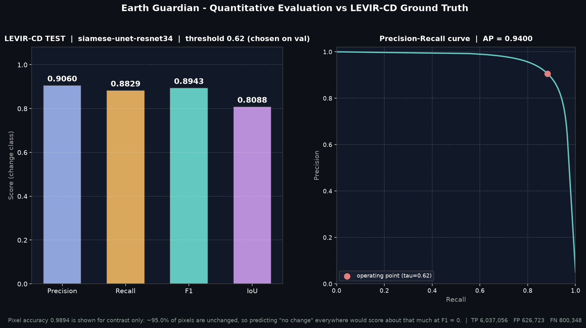
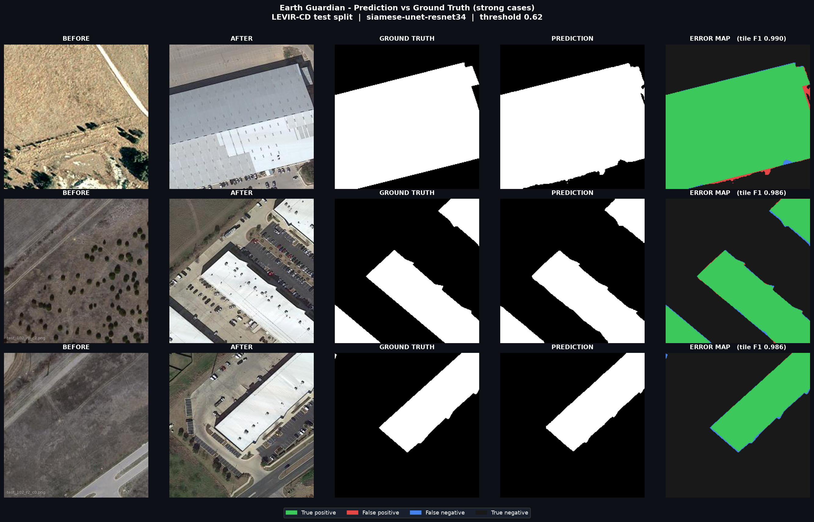
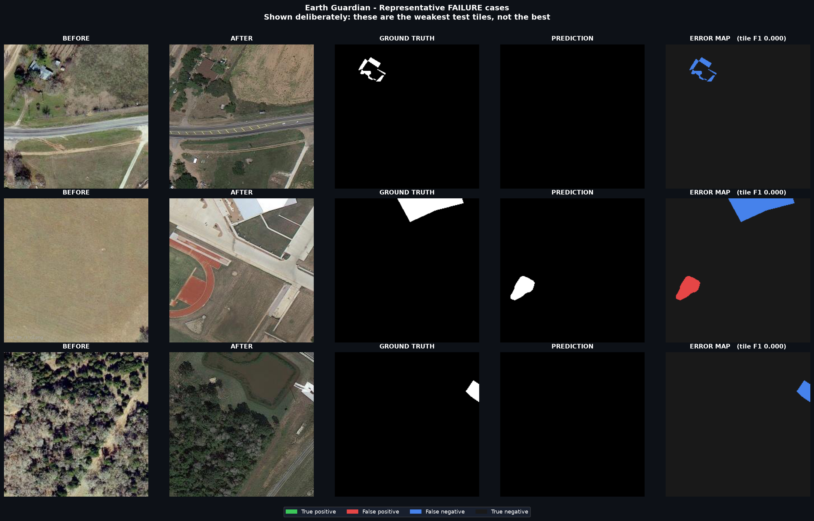

# Earth Guardian — Built-Environment Change Monitor

Supervised satellite change detection: given two co-located high-resolution
optical images of the same place at different dates, detect and localize
**structural (building) change**, quantify it, and visualize it against ground
truth.

> **Scope — read this first.**
> The trained model detects **building construction and demolition** in
> co-located optical imagery at roughly 0.3–1.0 m/px. It is trained and
> evaluated on **LEVIR-CD** (Texas, USA, 2002–2018).
> It does **not** detect floods, fires, deforestation, or snow/ice change, and
> it has not been validated on imagery from other sensors, other regions, or
> coarser resolutions. See [Limitations](#limitations).

---

## Project stages

| Stage | What it is | Status |
|---|---|---|
| **Stage 0** — `baseline/` | Frozen ImageNet ViT-B/16 feature distance + RGB heuristics. The original POC. **No training, no ground truth, no metrics.** Kept as an unsupervised control arm. | preserved, not the product |
| **Stage 1** — `src/` | Supervised Siamese U-Net trained on LEVIR-CD, evaluated against real ground-truth masks with Precision / Recall / F1 / IoU. | **current** |
| Stage 2 | Cross-dataset generalization (WHU-CD, S2Looking), semantic change types | planned |
| Stage 3 | Imagery provider (location + date search), georeferenced outputs | planned |

**Stage 0 is deliberately retained.** Its heuristic "Flood / Fire / Vegetation /
Snow" classes are *not* a trained capability and are not part of the product
path — they are RGB brightness thresholds. They remain in `baseline/` only so
the supervised model can be compared against the starting point.

---

## Results

<!-- RESULTS:START -->
**LEVIR-CD test split** — 2,048 tiles of 256x256, ground truth
from the official annotations. Threshold **tau = 0.625**,
selected on the validation split and applied to test unchanged.

| Metric (change class) | Test | Validation |
|---|---|---|
| **Precision** | **0.9060** | 0.8945 |
| **Recall**    | **0.8829** | 0.9096 |
| **F1**        | **0.8943** | 0.9020 |
| **IoU**       | **0.8088** | 0.8215 |
| Average precision | 0.9400 | 0.9525 |
| Pixel accuracy | 0.9894 | 0.9917 |

Confusion (test, pixels): TP 6,037,056 · FP 626,723 · FN 800,348 · TN 126,753,601

> **Pixel accuracy is reported only to show that it is uninformative.** About
> 94.9% of test pixels are unchanged, so a model that
> predicts "no change" everywhere scores roughly that accuracy at F1 = 0.
> Precision, Recall, F1 and IoU are computed for the **change class** only.

> **Threshold transfer.** The test-optimal threshold would have been
> 0.590 (F1 0.8944). We do not use it;
> the gap of +0.0001 F1 is the honest cost of selecting the
> threshold on validation, and is reported rather than hidden.

Model `siamese-unet-resnet34` v1.0.0 · encoder `resnet34` ·
best epoch 44 (best) of 50 run · trained on NVIDIA GeForce RTX 5060 Laptop GPU · training time 0:42:01 ·
test inference 15.5s for 2,048 tiles.




<!-- RESULTS:END -->

---

## Quick start

### 1. Environment

RTX 50-series (Blackwell) requires a CUDA 12.8+ build of PyTorch:

```bash
python -m venv .venv312                       # Python 3.12 recommended
.venv312\Scripts\activate                     # Windows
pip install torch torchvision --index-url https://download.pytorch.org/whl/cu128
pip install -r requirements.txt
```

### 2. Data

```bash
python scripts/download_levir.py     # ~2.5 GB, resumable, official split
python scripts/prepare_tiles.py      # 1024^2 scenes -> 256^2 tiles
```

See [docs/DATASET.md](docs/DATASET.md) for the directory layout and the
no-leakage argument.

### 3. Train

```bash
python -m src.train.train --epochs 50 --batch-size 32
```

Checkpoints the best model **by validation F1** to
`checkpoints/siamese_unet_r34_best.pt`. Loss is a poor selection signal here
because it is dominated by the ~95% background class.

### 4. Evaluate

```bash
python -m src.eval.evaluate
```

Selects the operating threshold on **validation**, then applies it unchanged to
**test**. Writes `outputs/results/evaluation.json`.

### 5. Figures

```bash
python -m src.viz.figures
```

Writes to `outputs/figures/`:

| File | Contents |
|---|---|
| `fig1_before_after.png` | Before \| After |
| `fig2_qualitative_success.png` | Before \| After \| Ground Truth \| Prediction \| Error map |
| `fig3_metrics.png` | Precision / Recall / F1 / IoU + PR curve |
| `fig4_failures.png` | Representative **failure** cases |

### 6. Inference

```bash
python predict.py --before images/before1.png --after images/after1.png
```

Writes a mask, probability map, overlay and a structured `result.json`.

### 7. Demo UI

```bash
streamlit run app.py
```

---

## The structured result

The JSON is the product's actual interface; every visual is a renderer over it.

```json
{
  "model":   {"name": "siamese-unet-resnet34", "version": "1.0.0",
              "trained_on": "LEVIR-CD", "val_f1": 0.0,
              "capability": "structural / building change detection"},
  "input":   {"height": 1024, "width": 1024, "gsd_m": null},
  "params":  {"threshold": 0.5, "min_area_px": 32, "tile": 256, "overlap": 64},
  "summary": {"changed_pixels": 0, "total_pixels": 1048576,
              "changed_area_pct": 0.0, "n_regions": 0,
              "mean_confidence": 0.0, "changed_area_m2": null},
  "regions": [{"id": 1, "area_px": 0, "bbox_xywh": [0,0,0,0],
               "centroid_xy": [0,0]}]
}
```

`changed_area_m2` is `null` unless a real `--gsd-m` is supplied. LEVIR-CD PNGs
carry no georeferencing, so reporting ground area would be fabricated.

---

## Method

**Model.** Siamese U-Net. One ImageNet-pretrained ResNet-34 encoder processes
both dates with **shared weights**. At each of five scales the two feature maps
are fused as `conv1x1(concat[|f_a − f_b|, f_a + f_b])` — the difference carries
the change signal, the sum carries scene context. A U-Net decoder returns one
logit per pixel at full input resolution. 25.1 M parameters.

**Loss.** `0.5 · BCE(pos_weight) + 0.5 · (1 − Dice)`. LEVIR-CD is ~95%
unchanged pixels; plain BCE collapses to predicting "no change".

**Inference.** Images larger than 256×256 are processed with overlapping tiles
blended by a 2-D Hann window, so full scenes come back without tile seams.

**Evaluation.** TP/FP/FN/TN are accumulated **globally** over a split, not
averaged per image — the LEVIR-CD convention. Per-image averaging inflates
scores because empty tiles produce degenerate per-image F1.

Full rationale: [docs/ARCHITECTURE.md](docs/ARCHITECTURE.md).

---

## Limitations

- **Buildings only.** Trained on LEVIR-CD, which annotates building change.
  Vegetation, water, fire and snow change are not represented in the labels and
  are not detected.
- **One geography.** All training data is from 20 regions in Texas, USA.
  Generalization to other regions and sensors is **untested** as of Stage 1.
- **Co-registration is assumed.** LEVIR-CD is pre-registered. There is no
  registration step in the current pipeline, so misaligned inputs will produce
  false positives.
- **No georeferencing.** Outputs are in pixel coordinates. No CRS, no m².
- **Single architecture, single seed.** No architecture comparison and no
  seed-variance study has been run yet; differences smaller than seed noise
  cannot be claimed.
- **Small and edge-cut structures.** The weakest test tiles are small,
  isolated rural buildings that are missed entirely, and buildings cut off
  by the 256x256 tile boundary (see `outputs/figures/fig4_failures.png`).
- **Checkpoint vs threshold selection.** The checkpoint is chosen by
  validation F1 at threshold 0.5, while evaluation selects the threshold on
  validation. Both use validation data only, so the test set is untouched,
  but they are different criteria. The largest disagreement observed during
  training was about 0.001 F1.

---

## Repository layout

```
baseline/          Stage 0 POC (frozen ViT + RGB heuristics) - preserved
scripts/           dataset download + tiling
src/data/          LEVIR-CD dataset and augmentation
src/models/        Siamese U-Net
src/train/         loss + training loop
src/eval/          metrics + evaluation protocol
src/inference/     change-analysis engine (product core)
src/viz/           presentation figures
predict.py         CLI
app.py             Streamlit demo
docs/              architecture + dataset notes
```

---

## Authors

Aryan Goyal (2427030332) and Aryan Tyagi (2427030344)
B.Tech CSE, Manipal University Jaipur — supervised by Dr. Ajay Kumar

Academic and research use. LEVIR-CD imagery is subject to Google Earth terms.
